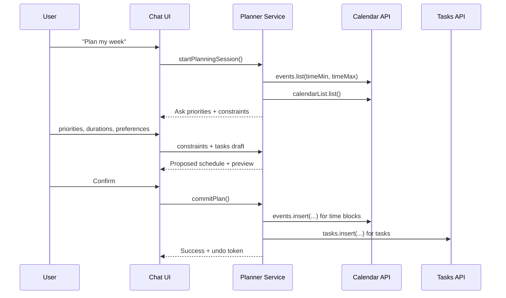

# PRD for a Chat-Style Week Planner That Writes to Calendar and Tasks

## Executive Summary

This PRD specifies a “glorified TODO list” that feels like a personal assistant in chat: it helps a user plan their week, converts intentions into tasks with clear priorities and estimated durations, and (upon explicit confirmation) writes time blocks and events directly into Google Calendar while also creating task records (optionally synced to Google Tasks). The core product bet is that **planning becomes frictionless when the user can talk naturally**, while the system handles the hard parts: time-blocking, conflict checks, rescheduling, and keeping the calendar state accurate as external changes occur.  

The highest-risk areas are (a) safe, user-trustworthy calendar writes (undoability, previews, and strict confirmation), (b) correctness and reliability of sync (incremental sync tokens, push notifications, and race conditions), and (c) OAuth scope selection + app verification and compliance with Google’s user data policies (Limited Use, disclosure, token protection). citeturn9view0turn9view1turn15view0turn8view0turn6view1

Key architectural insight: **time-blocked work must be represented as calendar events**, because Google Tasks’ `due` field stores only a date (the time portion is discarded), and the API does not support reading/writing a task’s due time of day. citeturn9view2

## Product Vision and Strategy

### Vision

A simple, beautiful planner where a user can say: “Help me plan next week: I have 3 meetings, I want 6 hours for deep work, and I need to finish my assignment by Thursday,” and the assistant produces a realistic week plan, writes it to the user’s calendar, creates trackable tasks, and keeps everything synced as the calendar changes.

### Product principles

The product should:

- **Stay lightweight:** a TODO list + calendar writing, not a full project management suite.
- **Be calendar-first for scheduled work:** time-blocking is a first-class output.
- **Be explicit about agency:** never modify the calendar without confirmation; always allow undo.
- **Be sync-correct by design:** prefer incremental sync + push notifications over polling for calendar changes. citeturn15view0turn8view0
- **Minimize scopes and data footprint:** request narrowly-scoped OAuth permissions; store only what is needed and for as long as needed. citeturn6view1turn5view4turn9view1turn9view0

### Positioning

- Competes primarily with “manual planning” (Google Calendar + simple task list), not enterprise task tools.
- Differentiates via:
  - conversational weekly planning
  - automatic time-block scheduling with constraints
  - rescheduling and conflict reconciliation as the calendar changes

## Target Users and Personas

### Persona: The Busy Student Planner

A motivated undergraduate juggling classes, assignments, club obligations, and study time. They don’t want a complex system—just a quick weekly plan and reminders. They value time-blocking, priority sorting, and fast rescheduling when life changes.

Core job: translate a messy list of obligations into a realistic week schedule.

### Persona: The Knowledge Worker With Meeting Overload

Has many meetings and needs protected focus time for “real work.” They want a planner that can find open blocks, detect conflicts, and defend focus time with minimal friction.

Core job: make time for priorities despite a shifting calendar.

### Persona: The Habit Builder

Wants recurring tasks (workouts, reading, planning) and gentle nudges. Needs recurring event creation, and a simple way to “roll over” unfinished tasks.

Core job: keep routines consistent while adapting to disruptions.

## Functional Requirements and User Flows

### Core feature set

The system must support:

- chat planning flow for weekly setup and day-to-day adjustments
- calendar integration that can read availability, create events/time blocks, and update/reschedule them
- task creation with priorities and estimated durations, plus “scheduled vs unscheduled” states
- conflict detection and resolution suggestions
- recurring tasks/events and time-block templates
- notifications (in-app and/or calendar reminders where appropriate)
- robust undo/revert for calendar writes

Google Calendar-specific capabilities relied upon include:
- reading and writing events (`events.list`, `events.insert`, `events.patch` or `events.update`) citeturn11view0turn5view1turn10view3turn7search31  
- controlling whether an event blocks time using `transparency` (`opaque` vs `transparent`) citeturn13view1  
- recurring events via RFC5545 RRULE strings in the `recurrence` field citeturn10view1turn5view1  
- reminders and notifications via event reminders and `sendUpdates` behavior citeturn9view3turn5view1  
- conflict checking using `events.list` time windows and/or `freebusy.query` citeturn11view0turn10view2  

Google Tasks-specific constraints:
- tasks can store `title`, `notes`, `status`, and `due`, but **`due` time-of-day is not supported** (date only) citeturn9view2  
- creating tasks uses `tasks.insert` and updating uses `tasks.patch` citeturn11view2turn11view1  

### Sample user flow: Weekly planning chat

```text
[Home]
  └── "Plan my week"

[Chat: Plan Mode]
  Assistant: "What are your top 3 priorities this week?"
  User: "Finish lab report (3h), study for midterm (8h), gym 3x (1h each)."

  Assistant: "Any fixed events I must work around? (meetings/classes)"
  User: "Classes MWF 10-11, discussion Tue 2-3."

  Assistant: "Preferred work hours and break rules?"
  User: "Weekdays 9-6, no blocks > 2h, 30m lunch."

  Assistant: "Draft plan ready: review blocks + confirm?"
  UI: [Week schedule preview + task list]
  User: "Looks good. Confirm."

[Commit]
  System writes blocks to calendar + creates tasks
  Assistant: "Done. Want reminders 10 minutes before each focus block?"
```

### Mermaid wireframe: Chat planning interaction (lo-fi)



### Sample user flow: Rescheduling after conflict

User behavior: drags a block in calendar or accepts a meeting invite; the planner must notice and adjust.

1. Calendar changes occur.
2. System detects change via push notification channel on Events (preferred) rather than constant polling. citeturn8view0turn5view2
3. System runs incremental sync using `syncToken` to fetch changed events efficiently; if token invalidates, it performs a full resync after a 410 response. citeturn15view0turn11view0
4. System recomputes plan consistency; if a scheduled task block is displaced, it proposes options:
   - move the displaced block to next available slot
   - split into smaller blocks
   - mark unscheduled and add to task list

### Mermaid: Calendar modification flow (safe-write with undo)

```mermaid
flowchart TD
  A[User requests change in chat] --> B[Compute diff: proposed calendar changes]
  B --> C[Preview UI: before/after]
  C -->|Confirm| D[Write changes via events.patch/update]
  C -->|Cancel| Z[No-op]
  D --> E[Persist mapping: internalBlockId <-> calendarId/eventId + etag]
  E --> F[Return Undo handle]
  F --> G[If Undo triggered within window]
  G --> H[Apply reverse diff (patch/update)]
```

### Conflict resolution requirements

The planner must detect conflicts using either:

- `events.list` bounded by `timeMin/timeMax` (works well when the user’s planning calendar set is known and not huge) citeturn11view0  
- or `freebusy.query` for multi-calendar availability queries, which also has explicit bounds and limits (e.g., `calendarExpansionMax`). citeturn10view2

The product should support both approaches, selecting the simplest viable method for MVP.

### Recurring tasks and time-blocking

- Recurring time blocks should be created as recurring calendar events using RRULE strings in the `recurrence` field. citeturn10view1turn5view1  
- For “focus time”-style blocks, Calendar supports specialized event types such as `focusTime`, but availability depends on primary calendars and on some users; and `eventType` cannot be changed after creation. citeturn14view0turn18view0turn13view2  
- The MVP may prefer creating standard events (`eventType=default`) for maximum compatibility, using `transparency=opaque` so the block actually reserves time. citeturn13view1

### Tables

#### Integration options comparison

| Option | What gets created where | Pros | Cons / constraints | Recommended use |
|---|---|---|---|---|
| Calendar-only | Tasks represented as calendar events (time blocks) | Simplest sync model; one source of truth | Unscheduled tasks become awkward; no native “task list” view | MVP if you want extreme simplicity |
| Hybrid (Calendar + Tasks) | Time blocks in Calendar; tasks in Google Tasks | Best of both: real time blocks + real task list | Tasks due time-of-day not supported (date only) citeturn9view2 | Strong default for planner apps |
| App-native tasks + Calendar writes | Internal tasks store; time blocks in Calendar; optional Tasks sync later | Full control (priorities, recurrence, metadata, analytics) | Requires more backend complexity; must meet Limited Use + secure handling expectations citeturn9view0turn9view1 | Best for long-term product extensibility |
| Third-party aggregator (e.g., unified calendar API) | Abstracted calendar/task sync | Multi-provider expansion | Added cost, dependency risk; less direct control | Not recommended for initial Google-first scope |

#### Key API endpoints and when to use them

| Capability | API method | Typical call | Notes |
|---|---|---|---|
| List calendars | CalendarList: list | `GET /calendar/v3/users/me/calendarList` citeturn16search2 | Needed for choosing which calendars to consider |
| Read events in time window | Events: list | `GET /calendar/v3/calendars/{id}/events?...timeMin&timeMax` citeturn11view0turn16search20 | Supports incremental sync via `syncToken`; restrictions apply |
| Create event | Events: insert | `POST /calendar/v3/calendars/{id}/events` citeturn5view1 | Used for time blocks and fixed events |
| Partial update event | Events: patch | `PATCH /calendar/v3/calendars/{id}/events/{eventId}` citeturn10view3 | Consumes 3 quota units; arrays overwrite when specified citeturn10view3 |
| Full update event | Events: update | `PUT /calendar/v3/.../events/{eventId}` citeturn7search31 | Does not support patch semantics; use ETags for atomicity citeturn7search31 |
| Quick create from text | Events: quickAdd | `POST /calendar/v3/.../events/quickAdd` citeturn16search0 | Useful for quick capture flow (not deterministic scheduling) |
| Availability query | Freebusy: query | `POST /calendar/v3/freeBusy` citeturn10view2 | Requires specific scopes (see OAuth table) citeturn10view2 |
| Subscribe to changes | Events: watch | `POST /calendar/v3/.../events/watch` citeturn8view0turn5view2 | Uses webhook callback + channel TTL; default TTL 604800s citeturn5view2 |
| Stop subscription | Channels: stop | `POST /calendar/v3/channels/stop` citeturn7search2 | Required for cleanup on disconnect |
| Create a task | tasks.insert | `POST https://tasks.googleapis.com/tasks/v1/lists/{tasklist}/tasks` citeturn11view2 | Cannot insert tasks assigned from Docs/Chat surfaces citeturn11view2 |
| Update a task | tasks.patch | `PATCH https://tasks.googleapis.com/tasks/v1/lists/{tasklist}/tasks/{task}` citeturn11view1 | Patch semantics |

#### OAuth scopes needed (minimize aggressively)

Calendar scope guidance explicitly recommends selecting the most narrowly focused scopes, and public apps using scopes that permit access to certain user data may require verification. citeturn6view1turn5view4

| Feature slice | 최소 recommended scopes | Notes |
|---|---|---|
| Read events for planning + write time blocks | `https://www.googleapis.com/auth/calendar.events` citeturn6view1 | Enables reading/writing events; does not inherently cover `freebusy.query` per docs |
| Read-only planning | `https://www.googleapis.com/auth/calendar.events.readonly` citeturn6view1 | Good for “preview-only” mode or onboarding |
| Free/busy queries | `https://www.googleapis.com/auth/calendar.freebusy` OR `.../calendar.events.freebusy` citeturn6view1turn10view2 | `freebusy.query` lists explicit acceptable scopes citeturn10view2 |
| Google Tasks CRUD | `https://www.googleapis.com/auth/tasks` citeturn5view4turn11view2turn11view1 | `tasks.readonly` for read-only citeturn5view4 |
| Minimal user identity (optional) | OpenID scopes (`openid`, `email`, `profile`) | Not Google Workspace-specific; used for account identity (implementation choice) |

## UX and Accessibility Requirements

### Chat UI requirements

- **Primary surface is chat**, with “Plan Mode” for weekly planning and “Quick Mode” for single actions (e.g., “move my deep work block to tomorrow”).
- Provide a persistent **schedule preview drawer** (week grid) that updates as the assistant proposes changes.
- Before any commit, show **diff-based preview** (before/after) and request confirmation: “Apply these 7 changes to your calendar?”

### “Lo-fi / retro game” aesthetic

Design goals:

- pixel-font style headers (but ensure readability in body text)
- subtle UI “game loop” metaphors:
  - “Inventory” = task list
  - “Map” = week schedule
  - “Quests” = priorities
- optional micro-interactions (sound toggle, haptic, “level-up” for completed weekly plan)

image_group{"layout":"carousel","aspect_ratio":"16:9","query":["pixel art mobile app UI retro game interface","retro RPG UI pixel art planner mockup","lofi pixel art UI design system"],"num_per_query":1}

### Accessibility requirements

- Contrast must meet WCAG 2.1 minimums (generally 4.5:1 for normal text, 3:1 for large text). citeturn17search9  
- Keyboard navigability on web; screen-reader friendly chat transcript with proper landmarking and message roles.
- Reduce motion option; accessible “sound off” default.
- Time-zone clarity: always display user’s time zone and provide explicit dates/times in confirmations.

## Technical Architecture and Google API Integration

### High-level architecture

A pragmatic architecture that scales from MVP to production:

- **Frontend:** Web + mobile (implementation open). Chat UI + schedule preview + task list.
- **Backend (Planner Service):**
  - planning session orchestration
  - deterministic scheduling engine (constraints → proposed time blocks)
  - integration layer for Calendar/Tasks APIs
  - notification + reminder scheduler
- **Data store:**
  - internal task model, plan sessions, user preferences, mapping of internal items to external IDs
- **Webhook receiver:**
  - receives Calendar push notifications and triggers incremental sync updates citeturn8view0turn5view2turn15view0

### Auth model (OAuth 2.0)

Use OAuth 2.0 web server flow when you have a backend capable of securely storing credentials; Google’s web server OAuth guidance is explicitly designed for applications that can securely store confidential information and maintain state. citeturn8view3turn8view4

Token handling requirements:

- Store refresh tokens in secure long-term storage; refresh tokens can be invalidated under certain issuance limits. citeturn8view4
- Encrypt tokens at rest; Google Workspace user data policy explicitly calls out encrypting OAuth access and refresh tokens at rest. citeturn9view1

### Calendar sync strategy

**Preferred approach:** Push notifications + incremental sync.

- Calendar supports push notifications (“webhook” callbacks) for resource changes; Events resources are watchable. citeturn8view0turn5view2  
- Watch channels have TTL behavior; `events.watch` supports `params.ttl` with a default of 604800 seconds (7 days). citeturn5view2  
- Use incremental synchronization with `syncToken` and `nextSyncToken`, including pagination rules and 410 handling. citeturn15view0turn11view0  
- Clean up on disconnect using `channels.stop`. citeturn7search2  

### Calendar write strategy (safety + correctness)

Use a two-phase write:

1. **Propose:** Build a structured “calendar diff” (create/update/delete) from the plan.
2. **Commit:** Apply via `events.insert` and `events.patch`/`events.update`.

Notes:
- `events.patch` consumes three quota units and overwrites arrays if provided; for some updates, a `get` + `update` flow can be safer. citeturn10view3turn7search31  
- For recurring events, avoid modifying instances individually unless specifically required; Google warns this creates many exceptions and can clutter calendars and increase notifications. citeturn10view1  
- Use `transparency='opaque'` for time blocks that should actually reserve time; `transparent` makes the user available. citeturn13view1  

### Data model (minimum viable)

Core objects (internal):

- **User**
  - id
  - timezone
  - preferences: working hours, break rules, meeting buffer, max block length
  - connected calendars (ids) + selected “planning calendars”
- **Task**
  - id
  - title, notes
  - priority (P0–P2 or 1–5)
  - estimate_minutes
  - due_date (date-only) + optional “target time window”
  - recurrence_rule (internal; may also emit RRULE for calendar events)
  - status (unscheduled / scheduled / done)
  - external_tasks: {tasklistId, taskId} optional
- **TimeBlock**
  - id
  - task_id (nullable for generic blocks)
  - calendarId, eventId
  - start, end
  - type: focus / admin / personal / meeting placeholder
  - etag (for concurrency checks) citeturn5view0turn11view0
- **PlanSession**
  - id
  - user_id
  - time_range (week)
  - constraints snapshot
  - proposed_diff, committed_diff
  - undo_deadline

Where to store metadata on events:
- Use **extended properties** for internal IDs and task linkage; Calendar explicitly supports hidden key-value “extended properties,” including private vs shared, and allows querying events by extended property constraints. citeturn10view0turn5view1turn11view0

## Security, Privacy, and Nonfunctional Requirements

### Security & privacy requirements

#### Policy compliance (Google user data)

Your handling of data from Google scopes must follow Limited Use restrictions (use only for prominent user-facing features; restrict transfers; no human access without explicit permission; no ad targeting). citeturn9view0turn9view1  

Disclosure requirements should be met in-product (not hidden only in legal pages), and consent must be explicit and affirmative. citeturn9view1  

#### Data minimization and retention

- Store only:
  - OAuth tokens (encrypted)
  - event IDs + minimal metadata needed for sync and rollback
  - user preferences needed for planning
- Prefer short retention for raw calendar content; cache only what’s needed for planning windows, especially given guidance discouraging permanent copies of user data. citeturn9view1turn9view0

#### Token handling

- Encrypt refresh/access tokens at rest. citeturn9view1turn8view4  
- Support token revocation and disconnect flows; stop watch channels on disconnect. citeturn7search2turn8view0  

### Nonfunctional requirements

#### Performance & reliability

- Planning request (generate a week plan) should feel interactive:
  - target: initial plan draft within a few seconds; refine incrementally
- Use incremental sync for event updates to reduce bandwidth and avoid rate limits. citeturn15view0turn11view0  
- Follow Calendar quota best practices: exponential backoff, randomized traffic, push notifications, and awareness of per-project/per-user sliding window quotas. citeturn8view2  

#### Scalability

- Event sync should scale with:
  - number of connected calendars
  - number of active watch channels (renew regularly; default TTL around 7 days) citeturn5view2
- Use queue-based jobs for:
  - webhook fan-out
  - rescheduling computations
  - batched calendar writes (serialized per calendar to avoid “write in quick succession” issues). citeturn8view2

#### Offline behavior

- Mobile: allow offline drafting (create tasks, set preferences, propose plan) and queue writes until online.
- Web: cached last-known schedule + offline “inbox capture.”
- Clearly label offline state and “pending sync.”

## Measurement, Delivery Plan, Economics, Risks, and Open Questions

### Success metrics / KPIs

Adoption and retention:

- Weekly active users (WAU), 4-week retention
- % of users who complete first weekly planning session within 10 minutes
- Median “time-to-plan” (first plan) and “time-to-reschedule” (a change request)

Calendar impact:

- Avg. calendar blocks created per user per week
- % plans committed vs abandoned at preview step (trust signal)
- Undo rate (should be low but non-zero; indicates safety net works)

Task completion quality:

- % scheduled tasks completed
- rollover rate of unfinished tasks week-to-week

Sync health:

- webhook delivery success rate
- incremental sync success rate vs full resync triggered by 410 GONE citeturn15view0turn11view0

### MVP scope and roadmap milestones

**MVP goal:** “Plan my week” → preview → confirmed write to calendar + tasks created + basic reschedule.

Milestones (suggested):

- Foundation
  - OAuth login, scope-limited consent, token storage, basic data model citeturn8view3turn6view1turn5view4turn9view1  
- Read + propose
  - pull events via `events.list` and build a free-time map citeturn11view0  
- Commit writes
  - create blocks via `events.insert`; update via `events.patch` or `events.update` with ETag strategy citeturn5view1turn10view3turn7search31  
- Task sync
  - create tasks via `tasks.insert`; update via `tasks.patch` citeturn11view2turn11view1  
- Sync correctness
  - push notifications + watch + incremental sync + 410 recovery citeturn8view0turn5view2turn15view0turn7search2  

**Post-MVP:**
- Recurring schedules (RRULE templates) citeturn10view1turn5view1  
- Advanced conflict resolution (multi-calendar freebusy, incremental scope escalation) citeturn10view2turn6view1  
- “Focus time” eventType blocks where supported (primary calendar only; may not work for all users) citeturn14view0turn18view0  
- Team sharing / delegating planning (higher privacy complexity)

### Prioritized feature backlog with acceptance criteria

| Priority | Feature | Acceptance criteria (testable) |
|---|---|---|
| P0 | OAuth connect + minimal scopes | User can connect calendar with `calendar.events`; app stores encrypted refresh token; user can disconnect and watch channels stop. citeturn6view1turn9view1turn7search2 |
| P0 | Weekly planning chat + preview | Given tasks + constraints, system produces a week schedule preview without writing; user must confirm to commit. |
| P0 | Write time blocks to calendar | On confirm, creates events via `events.insert`; blocks are `opaque` and appear as busy. citeturn5view1turn13view1 |
| P0 | Undo last commit | After commit, user can undo within configured window; reverse diff restores previous state (best-effort if external edits occurred). |
| P0 | Task creation | On plan commit, tasks are created internally; optional sync via `tasks.insert` when Tasks enabled. citeturn11view2 |
| P1 | Reschedule via chat | “Move my deep work to tomorrow afternoon” updates affected event(s) via patch/update and refreshes preview. citeturn10view3turn7search31 |
| P1 | Conflict detection | Before commit, system flags overlaps detected via `events.list` time range; offers alternative slots. citeturn11view0 |
| P1 | Push notification sync | System registers `events.watch`; on webhook, performs incremental sync with `syncToken`; renews channel before TTL expiry. citeturn5view2turn15view0turn8view0 |
| P2 | Recurring blocks | User can create recurring blocks; system writes RRULE recurrence and manages exceptions carefully. citeturn10view1turn5view1 |
| P2 | Free/busy multi-calendar | System can query availability via `freebusy.query` when user enables additional scope. citeturn10view2turn6view1 |
| P2 | Focus time event type | If supported, create `focusTime` events with required properties; fallback to default events otherwise. citeturn14view0turn18view0 |
| P2 | Reminders and attendee email updates | Support event override reminders and `sendUpdates` where relevant; respect per-calendar defaults. citeturn9view3turn5view1 |

### Estimated effort and rough cost ranges

Because team size and monetization are unspecified, below are scenario-based ranges grounded by public compensation and cloud pricing inputs.

#### Labor cost inputs (order-of-magnitude)

The entity["organization","U.S. Bureau of Labor Statistics","us government labor stats"] reports a median annual wage of **$133,080** for software developers (May 2024), with a wide distribution (10th–90th percentile). citeturn2search3turn2search7  

A practical planning heuristic: **fully loaded** cost (salary + benefits + overhead) is often higher than wage/comp alone; treat that multiplier as an open assumption and validate for your context.

#### Build effort (typical MVP)

- MVP (P0 + minimal P1): ~8–14 engineering weeks for a small team with strong product focus (frontend + backend + OAuth + Calendar writes + basic scheduling + basic QA).
- Add production-grade sync (webhooks + renewal + robust incremental sync + reconciliation): +4–8 weeks depending on error budgets and test coverage. citeturn15view0turn8view0turn5view2

(These are planning estimates; exact timelines vary by implementation choices.)

#### Cloud cost drivers (example: serverless on Google Cloud)

If you deploy on entity["company","Google Cloud","cloud services provider"] using Cloud Run and Firestore:

- Cloud Run free tier (requests-based billing): first **180,000 vCPU-seconds**, **360,000 GiB-seconds**, and **2 million requests** free per month (region-dependent example shown for us-central1). citeturn4search0turn4search12  
- Firestore free tier includes **1 GiB stored data**, **50,000 reads/day**, **20,000 writes/day**, **20,000 deletes/day**, plus outbound transfer quotas. citeturn4search1  
- If you use Cloud KMS for encryption key management, pricing examples include **$0.06 per active key version/month** and **$0.03 per 10,000 cryptographic operations** (plus other tiers). citeturn4search3turn4search15  

For an early MVP with low traffic, infrastructure may stay near free-tier thresholds; the largest variable cost may become LLM inference (if used), notification delivery (SMS), and customer support operations.

### Risks and mitigations

#### Risk: User trust / accidental calendar damage

Mitigations:
- Always preview diffs and require explicit commit.
- Provide “Writes only to a dedicated calendar” mode as an option (reduces fear).
- Add one-click undo (best-effort) and clear audit log of changes.

#### Risk: Sync correctness and race conditions

Mitigations:
- Use push notifications + incremental sync tokens; handle 410 by wiping local cache and resyncing. citeturn15view0turn11view0turn8view0  
- Persist `etag` and use update semantics carefully; favor `get` + `update` where atomicity matters. citeturn7search31turn11view0  
- Serialize writes per calendar to reduce operational rate limiting risk. citeturn8view2

#### Risk: OAuth verification + policy compliance overhead

Mitigations:
- Start with the minimal scopes needed and expand via incremental authorization only if a user enables advanced features. citeturn6view1turn5view4  
- Implement strong disclosures, explicit consent, and data deletion tooling. citeturn9view1turn9view0  
- Encrypt tokens at rest; document security practices. citeturn9view1turn8view4

#### Risk: Tasks feature mismatch

Mitigation:
- Treat Tasks as a lightweight “list sync” target; keep scheduling truth in Calendar because task due times are date-only. citeturn9view2turn13view1

### Open questions

- Should the MVP write to the user’s primary calendar, or create a dedicated “Planner” calendar to isolate changes?
- Is free/busy across multiple calendars a hard requirement (which may require additional scopes listed for `freebusy.query`), or is primary-calendar-only sufficient for v1? citeturn10view2turn6view1  
- What is the desired planning style: “strict schedule” (time-block everything) vs “hybrid” (some tasks scheduled, others remain in inbox)?
- Which platforms ship first: mobile, web, or both? What offline guarantees are required?
- Are “focus time” event types desirable given they’re not available for all users and only on primary calendars? citeturn14view0turn18view0  
- If an LLM is used: what data must never be sent to the model, and what personalization is allowed under Limited Use constraints? citeturn9view1turn9view0

### Concise, actionable next steps (Claude Code-ready)

Copy/paste prompt templates (you can feed directly into Claude Code):

1) **Backend skeleton + OAuth**
- “Create a backend service with OAuth 2.0 web-server flow for Google APIs, storing refresh tokens encrypted at rest, and exposing endpoints: `/auth/start`, `/auth/callback`, `/auth/disconnect`. Use `calendar.events` scope initially; design for incremental scope upgrades.” citeturn8view3turn8view4turn6view1turn9view1  

2) **Calendar write module**
- “Implement `createTimeBlock(calendarId, start, end, summary, metadata)` using `events.insert`, setting `transparency=opaque`. Store mapping with `calendarId/eventId/etag` and support update via `events.patch`.” citeturn5view1turn13view1turn10view3  

3) **Sync engine**
- “Implement incremental sync for events using `syncToken` and `nextSyncToken`, including pagination and handling 410 by clearing cache and performing full sync. Add Events watch channel creation and renewal with TTL.” citeturn15view0turn11view0turn5view2turn8view0  

4) **Task sync module**
- “Implement Google Tasks sync: create task via `tasks.insert`, update via `tasks.patch`. Store due as date-only; do not attempt time-of-day.” citeturn11view2turn11view1turn9view2  

5) **Chat planning contract**
- “Define a JSON contract for the planner: inputs (tasks with priorities/estimates/deadlines, constraints, existing busy windows) → outputs (proposed blocks + unscheduled tasks + rationale). Ensure outputs are deterministic and diffable for preview UI.”

